# 👋 Hello everyone, I'm Sergey `HixRaid`

Hi, I'm a `backend developer for Go`. I develop `microservices, bots and parsers`.

_An endless desire to develop and strive for ideals is the key to success in the world of technology. As a `Go developer`, I am on a path of continuous improvement, inspired by progress and new opportunities._

> Go, C and JavaScript

## 👑 Stack

&nbsp;
&nbsp;
&nbsp;
&nbsp;
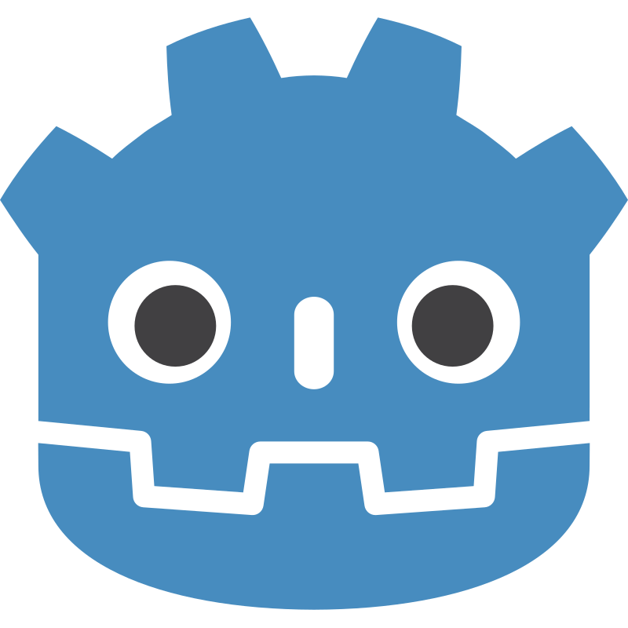&nbsp;
&nbsp;
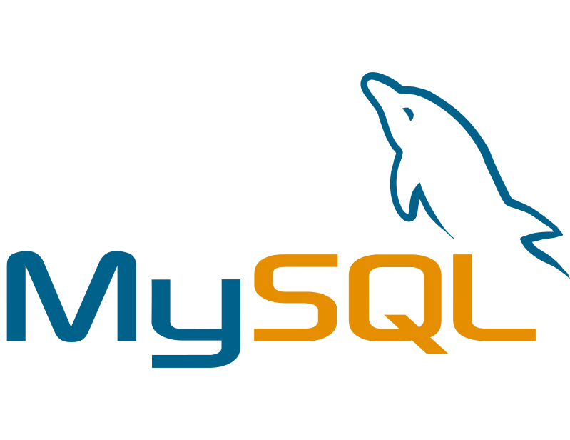&nbsp;
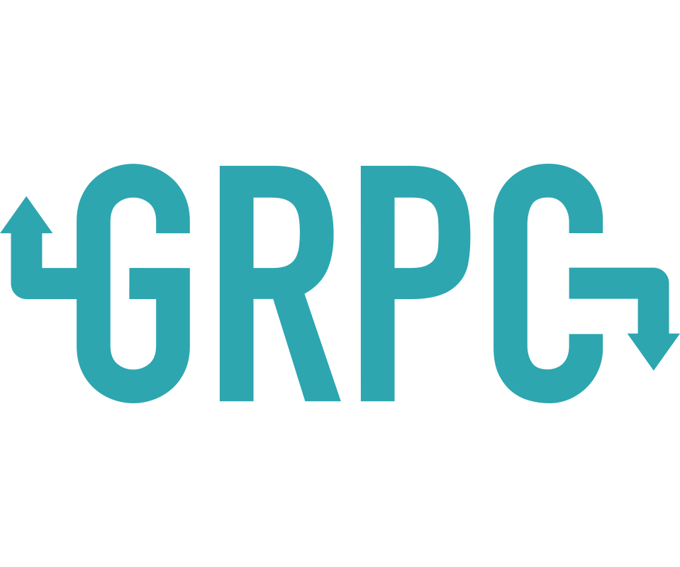&nbsp;
&nbsp;
&nbsp;
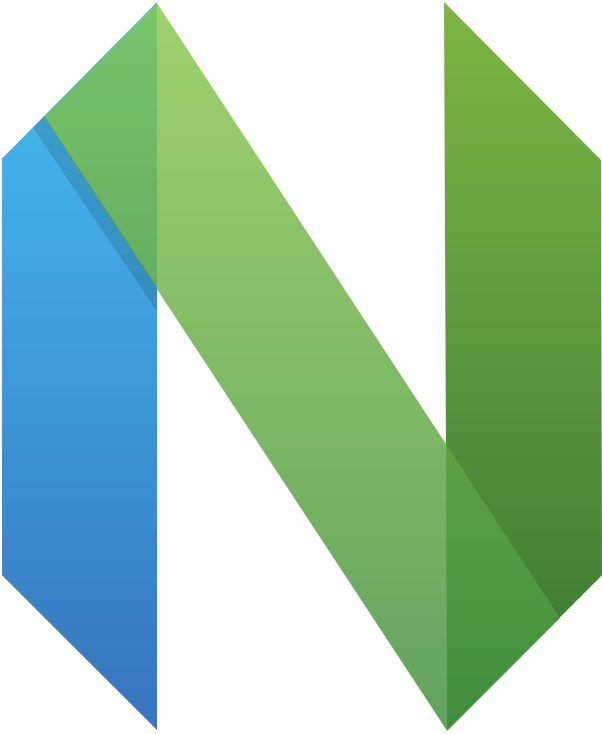&nbsp;
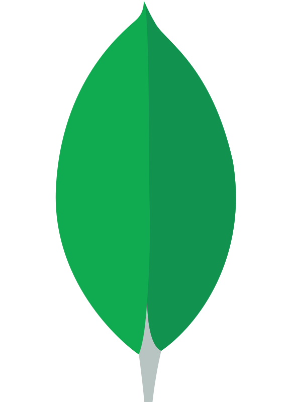&nbsp;
&nbsp;
&nbsp;
&nbsp;
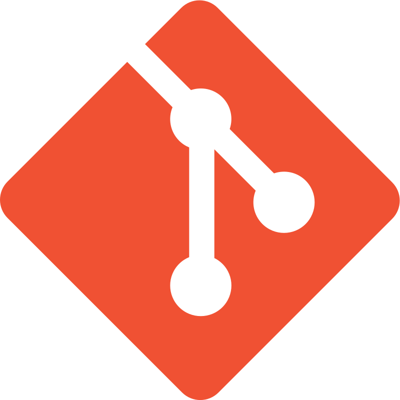&nbsp;
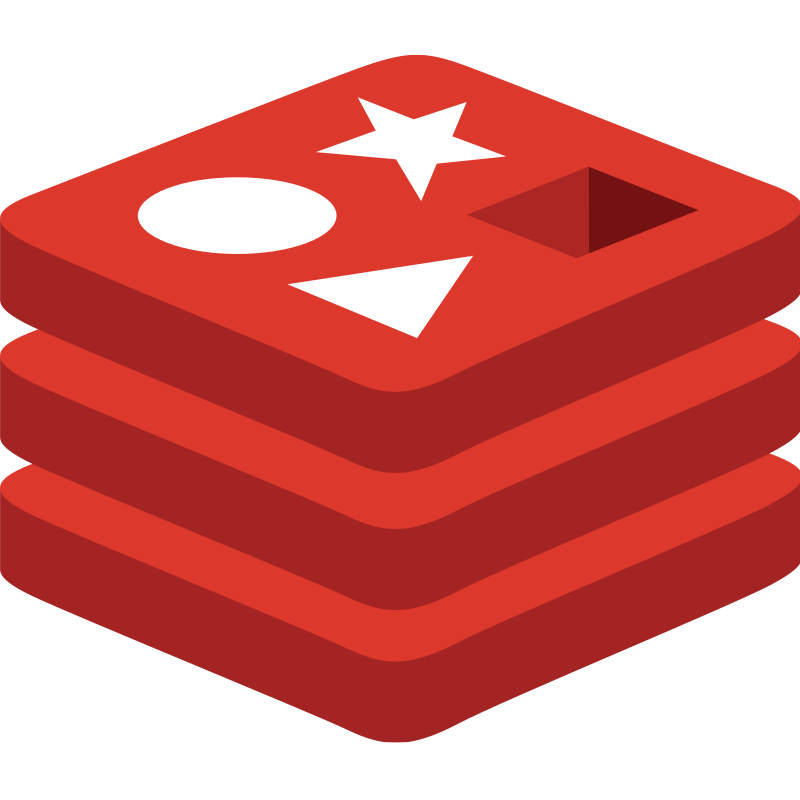&nbsp;
&nbsp;
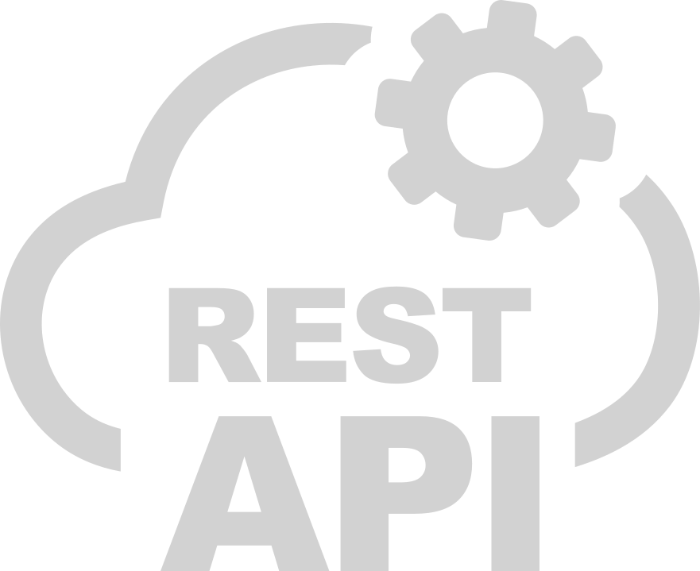&nbsp;
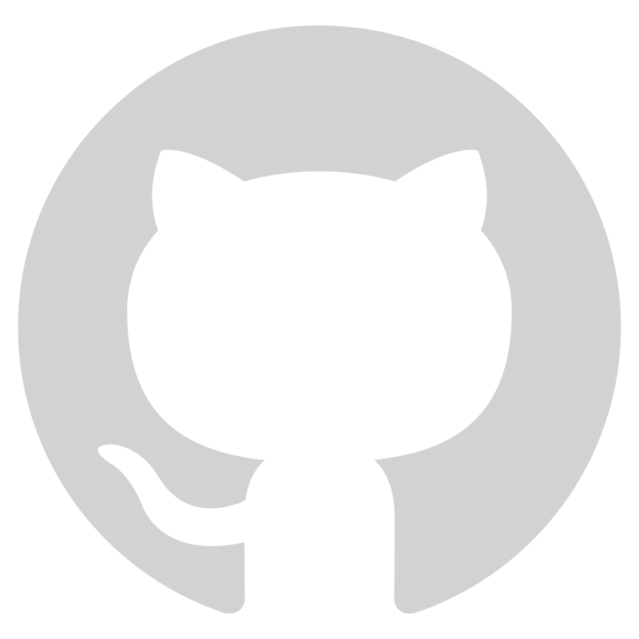&nbsp;
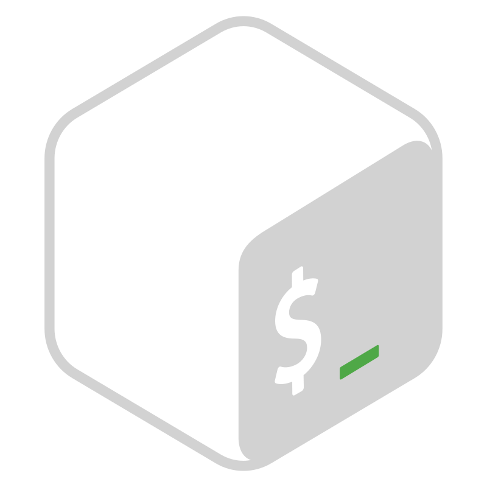

### 🎀 Frontend

> I can do `a little` in the `frontend`

&nbsp;
&nbsp;
&nbsp;
&nbsp;
&nbsp;
&nbsp;
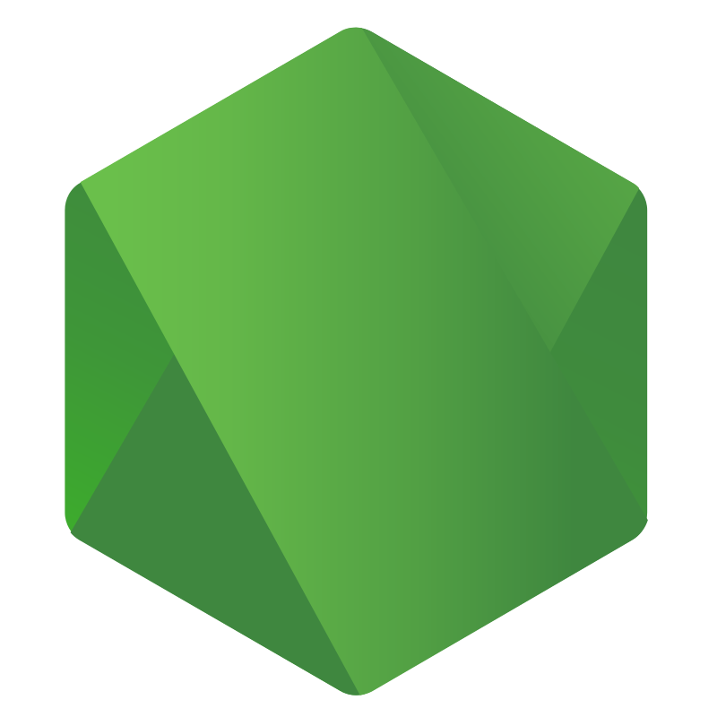&nbsp;
&nbsp;

## 🎨 Hobbies

- 🖼️ Design `Figma` `Gimp` `Blender`
- 🎮 Gamejam `Godot`
- 🎲 Rubik's Cube
