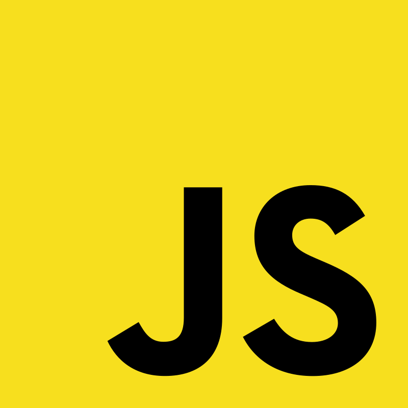

# 👋Hello everyone

My name is Sergey and I am a backend developer in Go.

> I can do a little in the frontend

## 🛠️Skills

&nbsp;
&nbsp;
&nbsp;
&nbsp;
&nbsp;
&nbsp;
&nbsp;
&nbsp;
&nbsp;

&nbsp;
&nbsp;
&nbsp;
&nbsp;
&nbsp;
&nbsp;

&nbsp;
&nbsp;
&nbsp;
&nbsp;
&nbsp;
&nbsp;
&nbsp;
&nbsp;

&nbsp;
&nbsp;

## 🎨Hobbies

- 🎮 Gamejam
- 🖼️ Design
- 🎲 Rubik's Cube
