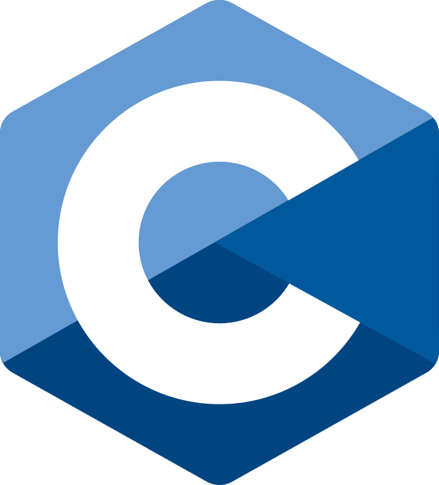
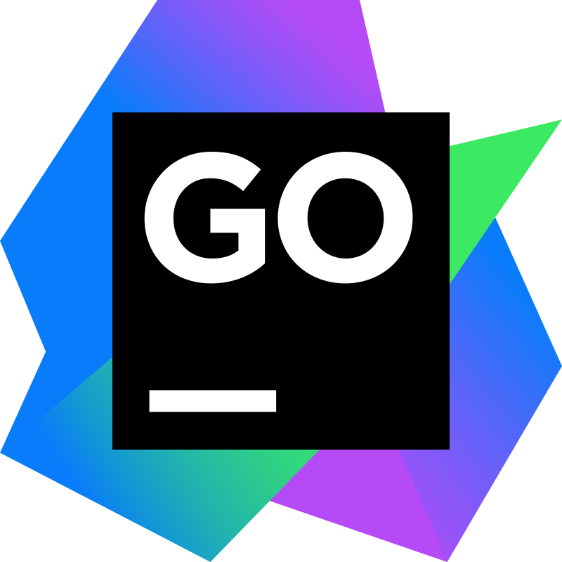

# 👋 Hello everyone

Hi, I'm a `backend developer for Go`. I develop `microservices`, `bots` and `parsers`.

_An endless desire to develop and strive for ideals is the key to success in the world of technology. As a Go developer, I am on a path of continuous improvement, inspired by progress and new opportunities._

- Full Name `Sergey Saveliev`
- Nicknames `HixRaid` `Private` `Sava`

> Go, C and JavaScript

## 👑 Stack

&nbsp;
&nbsp;
&nbsp;
&nbsp;
&nbsp;
&nbsp;
&nbsp;
&nbsp;
&nbsp;
&nbsp;
&nbsp;
&nbsp;
&nbsp;

### Frontend

&nbsp;
&nbsp;
&nbsp;
&nbsp;
&nbsp;
&nbsp;
&nbsp;
&nbsp;

> I can do a little in the `frontend`

### Software and systems

&nbsp;
&nbsp;
&nbsp;
&nbsp;
&nbsp;

> `Visual Studio Code` as the main IDE

## 🎨 Hobbies

- 🖼️ Design `Figma` `Gimp` `Blender`
- 🎮 Gamejam `Godot`
- 🎲 Rubik's Cube
